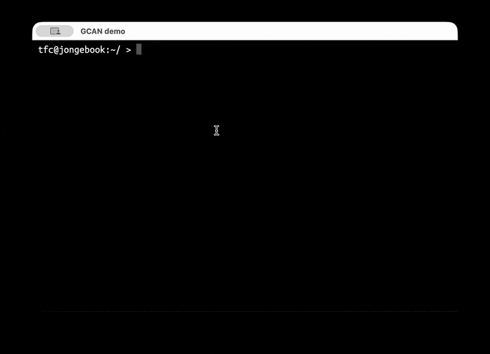

<div align="center">

# gcan — see what's eating your Nix store, and reclaim it

Find the GC roots quietly pinning gigabytes of your Nix store, and clear them out safely.

**Developed and maintained by [Applicative Systems](https://applicative.systems/)**

<p>
<a href="https://matrix.to/#/#applicative.systems:matrix.org"></a>
</p>

</div>



`nix-collect-garbage` only frees what nothing points to. The trouble is that a
lot _does_ point to things — every `nix build` result, every `direnv`
environment, every old profile generation is a **GC root** that quietly pins its
whole dependency closure on disk. Months later you run garbage collection,
it frees almost nothing, and you have no idea why.

`gcan` answers that question. It looks at all your GC roots and shows you, sorted
biggest-first, **how much disk each one is really keeping alive**, where it lives,
and how long it's been there — so you can see what to let go of and clear it out
safely.

```
      SIZE     AGE  ROOTS  LOCATION
     4.8GB      6d      7  /home/you/src/old-project/.direnv/  (direnv)
     3.7GB     14d     30  /home/you/src/training/.direnv/  (direnv)
     1.2GB     90d      1  /home/you/src/experiment/result-1
     741MB     21d      1  ~/.local/state/nix/profiles/profile-51-link
      ----
      26GB             TOTAL reclaimable
```

## Key Features

- **Real closure sizes:** roots ranked by the disk they're keeping alive, not their on-disk size.
- **direnv projects grouped:** one line per project with the true cost, not 30 cryptic hashes.
- **Interactive TUI:** browse, sort, and delete roots without leaving the keyboard.
- **Filter by size and age:** `--min-size 1G --min-age 30d` to focus on what's worth clearing.
- **Safe by default:** never offers system, booted, or current generations for deletion.
- **Scriptable:** JSON output, paths-only output, and exit codes that play well with shell pipelines.

## Why you'd want it

- **"`nix-collect-garbage` barely freed anything."** Something is pinning the
  store. `gcan` shows you exactly what, ranked by size.
- **direnv pack-rats.** Every project with a `.direnv` keeps a full copy of its
  flake inputs alive. A repo you haven't opened in three months can still be
  holding gigabytes. `gcan` groups all of a project's direnv roots into one line,
  so you see the true cost _per project_ — not 30 cryptic hashes.
- **Forgotten `result` links.** That `result` symlink from a `nix build` you ran
  once is pinning its entire closure forever. `gcan` lists them with their age.
- **Old generations.** Stale profile and home-manager generations add up; `gcan`
  surfaces the big, old ones.
- **Spring cleaning.** Sort by age, find what you haven't touched in months, and
  reclaim it in one pass.

## Using it

`gcan` has three subcommands: **`list`** (show roots), **`delete`** (remove them),
and **`tui`** (do it interactively).

List the biggest reclaimable roots:

```sh
gcan list
```

Narrow it down to the things actually worth clearing — say, anything over 1 GB
that you haven't touched in a month, oldest first:

```sh
gcan list --min-size 1G --min-age 30d --sort age
```

By default `list` only shows roots **you can safely delete**. Add `--all` to see
the full picture, including the live system and other protected roots (these are
marked and can never be deleted). You can also sort by `size`, `name`, or `age`
(`--sort`) and flip the order with `-r`.

### Browse and clean up interactively

```sh
gcan tui
```

This opens a full-screen view you can drive with the keyboard:

```
 ↑/↓ (or j/k)  move          s  sort by size       t  show all / only deletable
 Home/End      jump          n  sort by name       r  reverse the order
 D             delete        a  sort by age         q / Esc  quit
```

Press **D** on a root to delete it — `gcan` asks for confirmation, removes it, and
refreshes the list on the spot. You can start it narrowed down too, e.g.
`gcan tui --min-size 1G`.

### Clean up from the command line

```sh
# Delete everything ≥2 GB and older than 30 days, after a confirmation prompt:
gcan delete --min-size 2G --min-age 30d

# Delete and reclaim the space in one go (runs nix-collect-garbage for you):
gcan delete --min-size 2G --min-age 30d --gc

# Or pipe the exact symlinks somewhere and remove them yourself:
gcan list --min-size 1G --format paths | xargs rm
```

### One important last step

Deleting a root just removes the _link_ that was pinning the data — it tells Nix
the data is no longer wanted. To actually give the disk space back, run garbage
collection afterwards:

```sh
nix-collect-garbage
```

(or pass `--gc` to `gcan delete` to have it run for you).

## Safe by default

`gcan` will never offer to delete something that would break your system:

- It only lists roots **you own and can remove** — never root-owned system roots.
- The live system, the booted system, and your current home-manager generation
  (and anything else marked `current-*` / `booted-*`) are always protected.
- Deletions in the TUI and via `gcan delete` ask for confirmation first.

You can also export the full inventory as JSON (`gcan list --all --format json`)
to feed into your own scripts or dashboards.

## Professional Services

We offer commercial support to help you get the most out of Nix and your infrastructure:

- **Nix Infrastructure Consulting:** audit, design, and tune your build and deployment pipelines.
- **Custom Development:** tailored tooling for your stack.
- **Training:** hands-on Nix and NixOS for your team.
- **Integration Support:** help wiring Nix and friends into CI and developer workflows.

Contact us:

- 📧 [hello@applicative.systems](mailto:hello@applicative.systems)
- 🤝 [Schedule a meeting](https://nixcademy.com/meet)

## Community

- Join our [Matrix channel](https://matrix.to/#/#applicative.systems:matrix.org)
- Report issues on [GitHub](https://github.com/applicative-systems/gcan/issues)
- Contribute via [Pull Requests](https://github.com/applicative-systems/gcan/pulls)

## License

[MIT License](./LICENSE)
